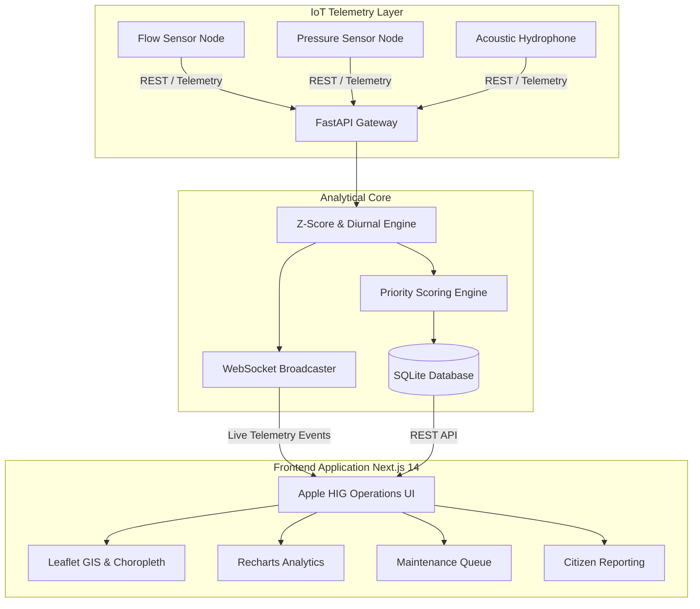

# 🌊 HydroPulse — Urban Water Leakage & Loss Detection Intelligence System

<div align="center">

[](https://nextjs.org/)
[](https://fastapi.tiangolo.com/)
[](https://tailwindcss.com/)
[](https://leafletjs.com/)
[](https://sqlite.org/)
[](https://opensource.org/licenses/MIT)

**Smart IoT Telemetry · Z-Score Anomaly Detection · GIS Pipeline Network Intelligence · Automated Priority Dispatch · Citizen Public Incident Reporting**

[🌐 **Live Demo on Vercel**](https://hydro-pulse.vercel.app) • [📖 Documentation](#-system-architecture) • [🚀 Quick Start](#-quick-start-guide) • [📡 API Reference](#-api-endpoints)

</div>

---

## 📌 Executive Summary

Municipal water utilities worldwide lose up to **30–50% of treated drinking water** to subterranean pipeline bursts, joint degradation, illegal tapping, and delayed leak identification. 

**HydroPulse** is an end-to-end municipal water intelligence platform that bridges real-time IoT acoustic/pressure sensor streams, automated statistical anomaly detection engines (Z-Score & Diurnal Confidence Envelopes), geospatial GIS pipeline modeling, and dual-corroborated field maintenance workflows.

---

## ✨ Key Capabilities & Modules

### 1. 📊 Executive Operations Dashboard (`/dashboard`)
- **Key Metrics (KPIs)**: Non-Revenue Water (NRW %), Treated Water Saved ($m^3$), Active Pipe Anomalies, and Overall Network Health Index.
- **District Metered Area (DMA) Telemetry**: Real-time flow ($m^3/h$), pressure ($bar$), and risk score monitor for 5 municipal distribution zones.
- **Interactive Choropleth GIS Risk Map**: Leaflet-powered GIS polygon visualization with dynamic risk level styling (Critical, High, Moderate, Low).
- **Live Anomaly Stream**: Real-time WebSocket event feed alerting dispatchers to flow surges and pressure drops within seconds of occurrence.

### 2. 📈 Water Loss Analytics & GIS Network Explorer (`/analytics`)
- **Diurnal Consumption Envelopes**: Recharts-powered statistical confidence bands ($\pm 20\%$) demonstrating diurnal consumption vs. detected nocturnal anomalies.
- **Pipeline Infrastructure GIS Layers**: Spatial inspection of municipal distribution lines categorized by **Pipe Material** (Cast Iron, Ductile Iron, HDPE, PVC, Steel), **Pipe Age** ($>35$ yrs, $20-35$ yrs, $<20$ yrs), and **Operational Condition** (Nominal, Leaking, Degraded, Under Repair).
- **DMA Zone Benchmarking**: NRW loss comparison against the international $<15\%$ benchmark target.
- **Financial Loss Ranking**: Area-wise matrix calculating volumetric loss ($m^3$) and economic damage ($) based on treated municipal tariffs.

### 3. 🔧 Maintenance & Field Dispatch Queue (`/maintenance`)
- **Multi-Factor Priority Scoring Engine**: Automatic ticket ranking based on:
  $$\text{Priority Score} = (\text{Severity} \times 0.35) + (\text{Population Affected} \times 0.25) + (\text{Loss Rate} \times 0.25) + (\text{Dual Confirmation} \times 0.15)$$
- **Lifecycle Work Order Stepper**: Visual tracking from **Reported** $\rightarrow$ **Crew Assigned** $\rightarrow$ **In Progress** $\rightarrow$ **Verified Fixed**.
- **Field Activity & Acoustic Log**: Work order field notes, acoustic listening logs, and valve isolation recording.
- **Public Report Corroboration**: Cross-references citizen-submitted GPS pins with live sensor anomalies to flag **Dual-Verified** incidents.

### 4. 📢 Citizen Public Incident Portal (`/citizen-report`)
- **Public GPS Pin Drop**: Interactive geolocation picker allowing residents to drop a pin on the exact leak site.
- **Photo Upload & Description**: Support for field image submission and detailed leak descriptions.
- **Unique Tracking Code Generation**: Generates permanent reference codes (e.g. `AQ-93821`) for residents to track municipal repair progress.
- **Dual-Verification Matching**: Automatically maps submitted coordinates to the corresponding DMA zone and flags corroborated sensor anomalies.

### 5. ⚙️ System Administration & Simulation Center (`/admin`)
- **Z-Score Sensitivity Configuration**: Zone-by-zone statistical standard deviation ($\sigma$) threshold sliders ($1.0\sigma - 4.5\sigma$).
- **On-Demand Leak Simulator**: Inject simulated pipe bursts, gradual joint leaks, high night flow, and valve failures for live demo and judging presentations.
- **IoT Sensor Registry**: Hardware health, battery levels, calibration offsets, and telemetry statuses for all deployed nodes.
- **Role-Based Access Control (RBAC)**: User management for Utility Staff, Field Technicians, and System Administrators.

---

## 🎨 UI/UX Design System

HydroPulse is built from the ground up following **Apple's Human Interface Guidelines (HIG)**:
- **Clean Palette**: iOS System Grey (`#F2F2F7`), pure white elevated surfaces (`#FFFFFF`), and Apple Blue (`#007AFF`) accents.
- **Spring Animations**: Physics-based cubic-bezier transitions (`cubic-bezier(0.4, 0, 0.2, 1)`).
- **Custom Vector Graphics**: Handcrafted SVG icons and custom Leaflet map markers.
- **Full Responsiveness**: Seamless layout adaptation from desktop operation centers to field tablet and mobile devices.

---

## 🏛️ System Architecture



---

## 🚀 Quick Start Guide

### Prerequisites
- **Node.js** v18.0 or higher
- **Python** v3.10 or higher
- **Git**

### 1. Clone the Repository
```bash
git clone https://github.com/AvishkarRanjane/HydroPulse.git
cd HydroPulse
```

### 2. Backend Setup (FastAPI)
```bash
cd backend
python -m venv venv

# On Windows:
.\venv\Scripts\activate
# On macOS/Linux:
# source venv/bin/activate

pip install -r requirements.txt
python main.py
```
*Backend runs on `http://127.0.0.1:8000` (Swagger UI available at `http://127.0.0.1:8000/docs`).*

### 3. Frontend Setup (Next.js 14)
```bash
cd ../frontend
npm install
npm run dev
```
*Frontend runs on `http://localhost:3000`.*

---

## 📡 API Endpoints

| Method | Endpoint | Description |
|---|---|---|
| `GET` | `/api/zones/summary` | Dashboard summary metrics & network health |
| `GET` | `/api/zones` | List all 5 District Metered Areas (DMAs) |
| `GET` | `/api/zones/geojson` | GeoJSON polygons for city risk map |
| `GET` | `/api/zones/pipes/geojson` | GeoJSON LineStrings for GIS network pipes |
| `GET` | `/api/anomalies/feed` | Real-time Z-Score anomaly stream |
| `GET` | `/api/anomalies/loss-ranking` | Area-wise water loss ranking table |
| `GET` | `/api/maintenance/tickets` | Priority work order list |
| `PUT` | `/api/maintenance/tickets/{id}` | Update ticket status & field inspection notes |
| `POST` | `/api/citizen/reports` | Submit citizen leak report with GPS coords |
| `GET` | `/api/citizen/track/{code}` | Track report status by reference code |
| `POST` | `/api/ingestion/inject-leak` | Inject simulated pipeline burst |
| `WS` | `/ws` | Real-time WebSocket telemetry stream |

---

## 🛠️ Tech Stack

- **Frontend**: Next.js 14 (App Router), React 18, TypeScript, Tailwind CSS, Leaflet GIS, Recharts, Axios
- **Backend**: Python 3.11, FastAPI, SQLAlchemy (Async ORM), Pydantic v2, Uvicorn, WebSockets
- **Database**: SQLite (ACID-compliant with full spatial schema)
- **Deployment**: Vercel (Frontend), Docker / Cloud Run ready (Backend)

---

## 📄 License

This project is licensed under the **MIT License** — see the [LICENSE](LICENSE) file for details.

---

<div align="center">
Developed with ❤️ for Smart Cities & Municipal Water Conservation.
</div>
